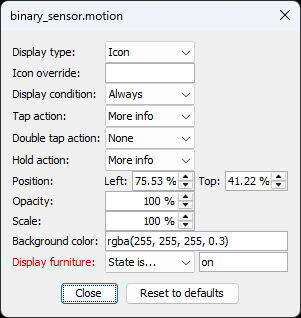

# Home Assistant Floor Plan Plugin for Sweet Home 3D

This project is a plugin for the [Sweet Home 3D](https://www.sweethome3d.com/)
interior design application.
It allows creating a 3D rendered floor plan panel for Home Assistant that
displays your home's current lighting state along with icons for toggling each
light, sensors and cameras.


## Features

* **3D Rendered Floor Plan** - Integrates with Sweet Home 3D to automatically
  generate images of your floorplan (displays current lighting state, sensors,
  and other entities with interactive icons for toggling lights)
* **Rendering Modes** - Allow user to select the best rendering option to
  generate images from his Sweet Home 3D project
* **Complete Renders Mode** - Renders images for all possible light combinations
  and rooms
* **YAML Configuration** - Generate a YAML file with the picture-elements
  structure for easy integration with Home Assistant
* **Configuration Options** -
  * Group detected lights by room
  * Adjust output resolution
  * Select rendering engine (YafaRay / SunFlow)
  * Adjust output quality (high / low)
  * Progress bar indicates rendering status
  * Create state icons for multiple entities from Home Assistant based on their
    names
  * Lights are detected as stand-alone or within groups under SH3D
  * Caches previously rendered images to save time when generating the next
    floorplan

## Rendering Modes

This plugin supports 3 modes for rendering the different lights

### CSS

In this (recommended) mode a base image is generated with all the lights turned
off. Then, for each light source, a new image is rendered with only it turned
on. The floor plan YAML then instructs the browser how to mix the different
lights sources from each render when multiple light sources interact with each
other.

This method offers good results with a low number of required images to render.

### Room Overlay

The floor plan is comprised of one base/background image without any of the
lights turned on. Then, for each light, it generates an overlay image where only
changed pixels are included and the rest of the image is transparent. This
allows for overlaying multiple images, with multiple lights turned on together
without the need for different renders for all possible combinations.

In order to get the best results for lights that do interact with each other,
i.e., the lights that appear in the same room, will be rendered with all
possible combinations. This approach significantly reduces the number of
rendered images, compared to all possible combinations of the entire floor.

### Complete Renders

This mode renders separate images for all possible light combinations on the
rendered floor. It requires generating many renders but offers the best quality.

## How To Use The Plugin

1. Download the latest plugin from the [releases](../../releases/latest) page
   and install it
2. Prepare your model to fit with the [criteria](#preparation) of this plugin
3. Start the plugin by clicking the "Tools"->"Home Assistant Floor Plan" menu
4. Modify the [configuration options](#configuration-options) accordingly
5. Click "Start"
6. Copy all images under `floorplan` folder to your Home Assistant path
7. Create a card of type `picture-elements` in Home Assistant and paste the
   contents of the generated `floorplan.yaml`

## Configuration Options


The configuration window displays a list of detected lights grouped according to
the room they're located in. Please verify the list matches your expectations.

* Width / Height - Configure the required output resolution of the rendered
  images
* Light mixing mode - See [Rendering Modes](#rendering-modes)
* Render times - The date and times of the rendered images, affects the sun
  position, intensity and color. Each render will be displayed from the selected
  time until the next one in the list. Adding more than one hour requires
  [adding a time sensor](#adding-time-sensor)
* Renderer - Select which rendering engine to use, YafaRay or SunFlow
* Image format - The image file format of the resulting floor plan (PNG or JPEG)
* Quality - Choose the rendering quality (low or high)
* Sensitivity - [1, 100] The degree by which two pixels need to be different
  from one another to be taken into account for the generated overlay image.
  Only relevant for "room overlay" light mixing mode and RGB lights
* Output directory - The location on your PC where the floor plan images and
  YAML will be saved

The progress bar at the bottom will indicate how many images need to be rendered
for the complete floor plan and will progress as they are ready.

You can also click on any entity from the list to reveal additional settings
that allow you to customize the entity according to your needs.

 

> [!NOTE]
> Settings that were modified from their default values are displayed in red

* Display type - Configure how the entity is displayed on the floorplan, see
  [Elements](https://www.home-assistant.io/dashboards/picture-elements/#elements)
* Display Condition - Configure when the entity should be displayed
* Tap action - Define what to do when the entity is tapped/clicked on, see
  [Tap action](https://www.home-assistant.io/dashboards/actions/#tap-action)
* Double tap action - Define what to do when the entity is double-tapped/clicked
  on, see [Double tap Action](https://www.home-assistant.io/dashboards/actions/#double-tap-action)
* Hold Action - Define what to do when the entity is held/long-pressed, see
  [Hold action](https://www.home-assistant.io/dashboards/actions/#hold-action)
* Position - Override the entity's icon/label position
* Opacity - Define the opacity of the entity's icon/label
* Scale Factor - Define the size of the entity's icon/label
* Blinking - Toggle ability to blink the entity's icon/label when visible
* Background color - Define the background color of the entity's icon/label
* Display furniture - Only for furniture, set the entity state conditions for
  which the piece of furniture is either visible or hidden in the floor plan
* Always on - Only for lights, set light as always on removing its icon and it
  won't be affected by the matching Home Assistant state
* Is RGB(W)/dimmable light - Only for lights, set light as an RGB or dimmable
  light that will change its color and brightness in the floorplan according to
  the color set in Home Assistant. This requires installing the
  [config-template-card](https://github.com/iantrich/config-template-card)
  custom Lovelace card.

  :warning: **Note:** RGB/dimmable lights are only supported in the CSS
  rendering mode.

### Adding Time Sensor

In order to support displaying different floorplan images according to the
current time, we need to add a sensor to HA that will represent the time. This
needs to be done only once for each Home Assistant instance.

First, we add a `Time & Date` sensor by clicking on
[](https://my.home-assistant.io/redirect/config_flow_start/?domain=time_date)
or, by manually navigating to `Settings` ->`Devices & services` ->
`Add integration` -> `Time & Date`. Then, choose the `Time (UTC)` sensor type and click `Submit`.

Next, we'll need to create a template sensor that will convert this textual
sensor to a numeric one that can be used by the floorplan YAML. Click on
[](https://my.home-assistant.io/redirect/helpers/)
or, manually navigate to `Settings` -> `Devices & services` -> `Helpers`. Click
the `Create Helper` button, choose a `Template` helper and click on
`Template a sensor`. Name the sensor, `Time as number (UTC)` and enter the
following template:
```
{{states("sensor.time_utc").split(":") | join | int}}
```

> [!TIP]
> As these sensors will change their value every minute, it's best to exclude
> them from the recorder so they won't be logged

## Preparation

* Set each light in SW3D with the entity name of Home Assistant, i.e.,
  `light.xxx`, `switch.xxx`
* Only light sources that are **visible** and have a **power > 0%** are
  considered
* If you have multiple light sources that are controlled by the same switch,
  e.g., spot lights, give them all the same name
* If you want to add a tool-tip to the state icon in Home Assistant, enter it
  in to the description field of the SH3D furniture
* If lights from two different rooms do interact with each other, e.g., there's
  a glass door separating the rooms, you can give both rooms the same name and
  they'll be treated as one
* To include state icons and labels for sensors, set the relevant furniture name
  to the entity name of Home Assistant, available entities for this plugin:
  * `air_quality.xxx`
  * `alarm_control_panel.xxx`
  * `assist_satellite.xxx`
  * `binary_sensor.xxx`
  * `button.xxx`
  * `camera.xxx`
  * `climate.xxx`
  * `cover.xxx`
  * `device_tracker.xxx`
  * `fan.xxx`
  * `humidifier.xxx`
  * `input_boolean.xxx`
  * `input_button.xxx`
  * `lawn_mower.xxx`
  * `light.xxx`
  * `lock.xxx`
  * `media_player.xxx`
  * `remote.xxx`
  * `sensor.xxx`
  * `siren.xxx`
  * `switch.xxx`
  * `todo.xxx`
  * `update.xxx`
  * `vacuum.xxx`
  * `valve.xxx`
  * `water_heater.xxx`
  * `weather.xxx`

## Suggestions

For best results, it's suggested to:
* Set the 3D view's time to 8:00 AM and disable ceiling lights

When using the "Room overlay" light mixing mode, it's also suggested to:
* Use a dark background for the 3D view
  * It can later be converted to transparent using an image editor
* Close all the doors between individually lighted rooms

## Frequently Asked Questions

* **Where should I copy the generated files and what should I copy?**
  After the process is complete, copy the floorplan folder and `floorplan.yaml`
  to your Home Assistant path, e.g., `/config/www`.

* **How do I select the desired perspective for rendering?**
  Before activating the plugin, set the SH3D project to the specific 3D point of
  view that you want to be rendered.

* **How do I change the rendering settings?**
  Prior to activating the plugin, go to "Create photo..." in the SH3D project
  and adjust the settings there. You do not need to render or save anything;
  simply make the changes and close the dialog.

* **Can I work on the SH3D project while rendering?**
  No, do not make any changes or interact with the 3D view while it’s rendering.
  These actions will be captured by the plugin as it scripts the renders one by
  one. Start the rendering process and then leave it to complete.

* **What's the difference between `renders` and `floorplan` folders?**
  The renders directory includes the rendered images as generated by SH3D. The
  floorplan directory includes the images you need to copy over to Home Assistant.
  With the CSS option, both directories are pretty much the same, except that the
  base image (with all the lights turned off) exists only in the floorplan
  directory. This is because in this mode, we let the browser to the light
  blending and this plugin doesn't need to do anything special.

  With the room overlay mode, the renders, again, includes all the images
  generated by SH3D while the floorplan directory will include the processed
  images with the transparent background.

  The renders directory was created (back when room overlay was the only option)
  in case one wanted to change any parameters (like the sensitivity) to generate a
  new floor plan without needing to wait for all the renders from SH3D, which
  don't change. It's basically a cache of rendered images.

* **What's the use of `Use existing renders` option?**
  Technically this option can work with any mode. You can start with the CSS
  mode and generate the least number of needed renders but then decide to switch
  to room overlay. When doing so, you already have part of the required renders
  and there's no need to generate them again. If you started with room overlay and
  switched to CSS, you'll have all of the required images and the whole process
  will be done in a few seconds

## Possible Future Enhancements
- [x] Allow selecting renderer (SunFlow/Yafaray)
- [x] Allow selecting quality (high/low)
- [x] Allow selecting date/time of render
- [x] Create multiple renders for multiple hours of the day and display in Home
      Assistant according to local time
- [x] Allow stopping rendering thread
- [X] Allow enabling/disabling/configuring state-icon
- [x] Support including sensors state-icons/labels for other items
- [ ] Support fans with animated gif/png with css3 image rotation
- [x] Make sure state-icons/labels do not overlap
- [x] Allow using existing rendered images and just re-create overlays and YAML
- [ ] After rendering is complete, show preview of overlay images
- [x] Allow overriding state-icons/labels positions, and save persistently
- [X] Allow defining, per entity, if it should be an icon or label, and save
      that persistently
